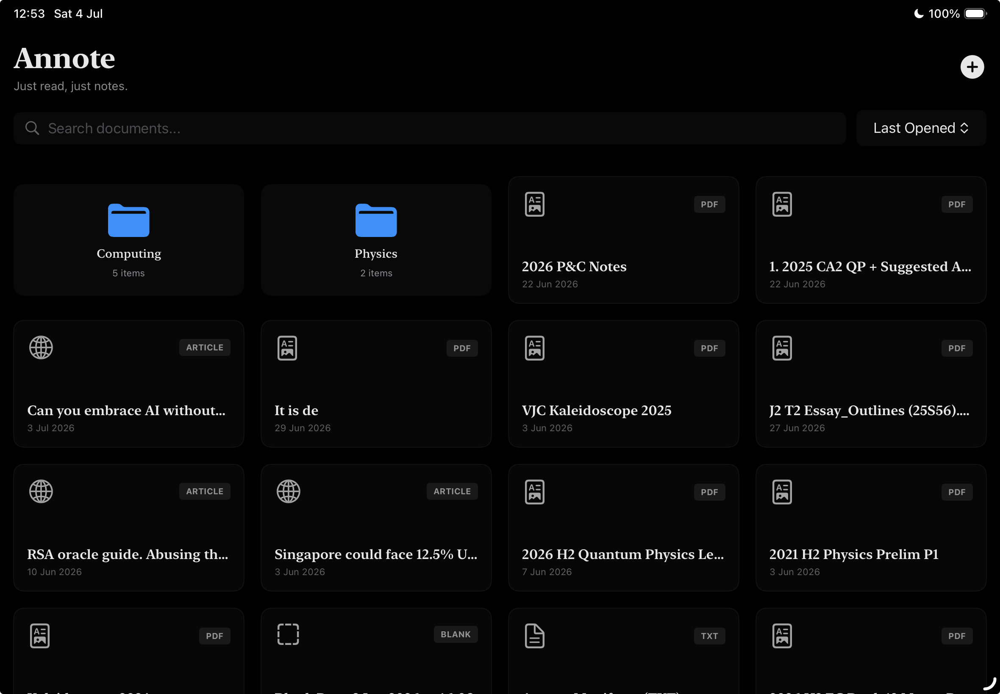
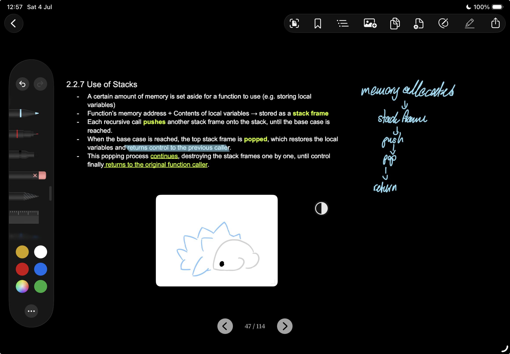

<p align="center">
  
</p>

<h1 align="center">Annote</h1>

<p align="center">
  A reading, annotation, and sketching app for iPad.
</p>

<p align="center">
  
  
  
  
</p>

<p align="center">
  
  &nbsp;
  
</p>

---

## Features

**Documents**
- PDF, Markdown, TXT, EPUB, DOCX, Image, and web article support
- Web article import — paste a URL, fetch and render a clean reading view
- Camera OCR scan — scan physical pages and import as text
- PDF export — flatten annotations and overlays to a shareable PDF

**Annotation**
- PencilKit annotations with per-page persistence
- **Highlight Assist** — draw over text with a marker; snaps to word boundaries automatically
- **Hold-to-Straighten** — hold the end of a stroke to preview and commit a perfectly straight line
- Image overlays with drag, scale, and color/grayscale toggle
- Page overlays — pin any page from another document as a floating reference

**Organisation**
- Folders — organise documents; move docs between folders
- Document merging — splice pages from other documents inline
- Page management — add blank pages, delete, reorder via the Navigator
- Bookmarks — bookmark pages and jump from the Navigator
- Outline / TOC — auto-extracted from PDFs, articles, EPUB/DOCX headings; add manual items per-page
- Custom page names

---

## Requirements

| | |
|---|---|
| Platform | iOS / iPadOS 17+ |
| Xcode | 16+ |
| Swift | 5.10+ |

---

## Setup

```bash
git clone <repo-url>
open Annote.xcodeproj
```

1. Set your development team under **Signing & Capabilities**
2. Build and run on a simulator or device

---

## Architecture

<details>
<summary><strong>File overview</strong></summary>

<br>

| File | Role |
|---|---|
| `AnnoteApp.swift` | App entry point, SwiftData container |
| `Document.swift` | SwiftData models: `AnnoteDocument`, `AnnoteFolder`, `PageAnnotation`, `DocumentImage`, `DocumentMerge`, `PageImageOverlay`, `ManualOutlineItem` |
| `ContentView.swift` | Library grid, folder navigation, import flows |
| `ReaderView.swift` | Per-document reading view, toolbar, virtual page resolution, `OutlineView` |
| `PDFDocumentView.swift` | Core `ZoomablePageView` UIViewRepresentable — page rendering, PencilKit canvas, overlays, OCR, highlight assist, straightening |
| `Theme.swift` | Color/font theme helpers |

</details>

---

## License

MIT